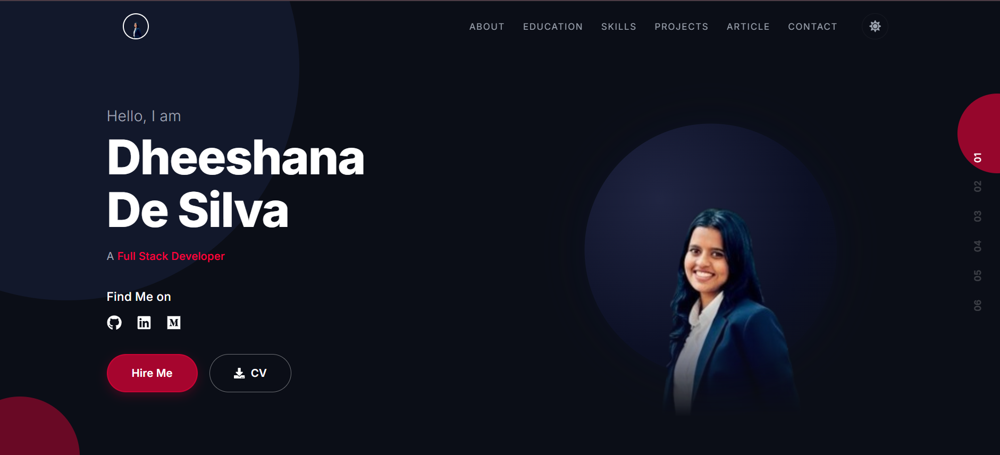

# 🌐 Dheeshana De Silva — Personal Portfolio

A modern, responsive personal portfolio website built with React and Vite, showcasing my projects, skills, education, and articles.

🔗 **Live Demo:** [dheeshana-desilva.github.io/portfolio](https://dheeshana-desilva.github.io/portfolio/)

---

## 📸 Screenshot


---

## ✨ Features

- **Responsive Design** — Fully responsive layout that works on desktop, tablet, and mobile
- **Dark / Light Theme** — Toggle between dark and light modes
- **Smooth Navigation** — Single-page scroll navigation with animated transitions
- **Hero Section** — Animated introduction with profile image
- **Education** — Academic background with institution details
- **Tech Stack** — Skills and technologies showcase
- **Projects** — Carousel slider displaying project details with links
- **Articles** — Blog articles section with card-based layout
- **Contact Form** — Functional contact form powered by [Formspree](https://formspree.io/)
- **Animations** — Smooth animations and transitions using Framer Motion

---

## 🛠️ Tech Stack

| Category | Technology |
|---|---|
| **Framework** | React 19 |
| **Build Tool** | Vite 8 |
| **Styling** | CSS, Tailwind CSS |
| **Animations** | Framer Motion |
| **Icons** | React Icons |
| **Navigation** | React Scroll |
| **Contact Form** | Formspree React |
| **Deployment** | GitHub Pages (gh-pages) |

---

## 📁 Project Structure

```
portfolio/
├── public/
│   ├── favicon.png
│   ├── CV.pdf
│   └── icons.svg
├── src/
│   ├── assets/            # Images and static assets
│   ├── components/
│   │   ├── Navbar.jsx     # Navigation bar with theme toggle
│   │   ├── Hero.jsx       # Hero/landing section
│   │   ├── Education.jsx  # Education background
│   │   ├── TechStack.jsx  # Skills & technologies
│   │   ├── Projects.jsx   # Projects carousel
│   │   ├── Articles.jsx   # Blog articles section
│   │   ├── Contact.jsx    # Contact form (Formspree)
│   │   └── Footer.jsx     # Footer
│   ├── App.jsx            # Main app component
│   ├── App.css
│   ├── index.css          # Global styles & CSS variables
│   └── main.jsx           # Entry point
├── index.html
├── vite.config.js
└── package.json
```

---

## 🚀 Getting Started

### Prerequisites

- [Node.js](https://nodejs.org/) (v18 or higher)
- npm

### Installation

1. **Clone the repository**

   ```bash
   git clone https://github.com/Dheeshana-DeSilva/portfolio.git
   cd portfolio
   ```

2. **Install dependencies**

   ```bash
   npm install
   ```

3. **Start the development server**

   ```bash
   npm run dev
   ```

4. Open [http://localhost:5173/portfolio/](http://localhost:5173/portfolio/) in your browser.

---

## 📦 Deployment

This project is deployed to **GitHub Pages** using the `gh-pages` package.

To deploy:

```bash
npm run deploy
```

This will:
1. Build the project (`vite build`)
2. Push the `dist/` folder to the `gh-pages` branch
3. GitHub Pages will serve the site automatically

---

## 📬 Contact

- **Email:** [dheeshanadesilva2002@gmail.com](mailto:dheeshanadesilva2002@gmail.com)
- **GitHub:** [Dheeshana-DeSilva](https://github.com/Dheeshana-DeSilva)
- **LinkedIn:** [dheeshana-de-silva2002](https://www.linkedin.com/in/dheeshana-de-silva2002/)

---

## 📄 License

This project is open source and available under the [MIT License](LICENSE).
